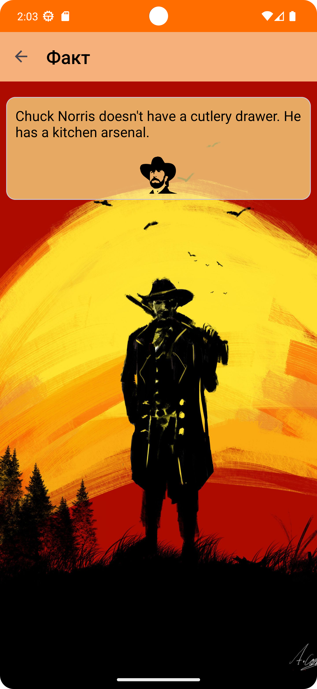

## BiaApp

**Реализовано:**

- заставка

- список шуток, получение шутки с сервера, переход на шутку с полным текстом по клику, добавление
  шутки

            

- Сервер выдает только одну случайную шутку по запросу. Получение по одной, сохранение в библиотеку
  Room, демонстрация списка из неё
- Использована архитектура MVVM
- Библиотеки Room, Coroutines, Recyclerview, Navigation, Dagger Hilt, Retrofit, GSON
